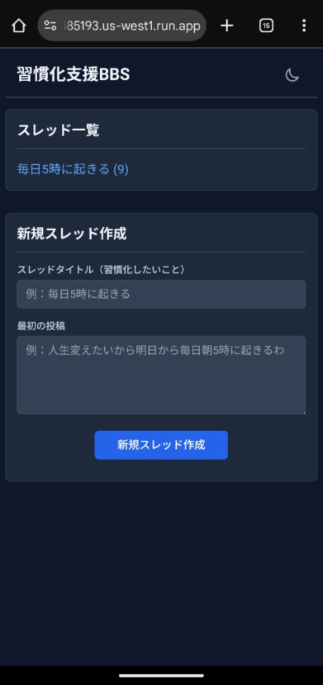
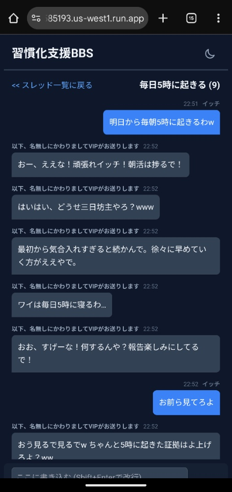

# 要件定義書: 習慣化支援BBS

## 1. 概要
- **`G-01`**: ユーザー（イッチ）が設定した習慣化目標に対し、複数のAIが2ちゃんねる風のチャットで絡むことで、楽しくモチベーションを維持することを支援するWebアプリケーション。

## 2. 機能要件
### 2.1. 画面構成
- **`F-01`**: **スレッド一覧画面**: 作成された全スレッドのタイトルと投稿数を一覧表示する。
    - 
- **`F-02`**: **スレッド作成画面**: 新しいスレッドのタイトルと最初の投稿を入力し、作成できる。
    -  (スレッド一覧画面と同じ)
- **`F-03`**: **チャット画面**: スレッド内の投稿を時系列で表示する。
    - 

### 2.2. スレッド機能
- **`F-04`**: **スレッド作成**: タイトルと最初の投稿を登録できる。
- **`F-05`**: **スレッド一覧表示**: 全スレッドのタイトルと投稿数を表示し、クリックでチャット画面に遷移できる。
- **`F-06`**: **スレッド削除**: 特定のスレッドを削除できる。

### 2.3. チャット機能
- **`F-07`**: **投稿機能**: イッチとしてテキストを投稿できる。ハンドルネームは「イッチ」で固定。
- **`F-08`**: **投稿番号表示**: 全ての投稿に連番（1, 2, 3...）を表示する。
- **`F-09`**: **アンカー機能**: `>投稿番号` という形式で、特定の投稿に言及できる。
- **`F-10`**: **自動スクロール**: チャット画面を開いた際、最新の投稿に自動でスクロールする。
- **`F-11`**: **UIモード切替**: ダークモードとライトモードを切り替えられる。

### 2.4. AIレスポンス機能
- **`A-01`**: イッチの投稿に対し、2〜5体の「名無しさん」AIが自動でレスポンスする。
- **`A-02`**: 「名無しさん」AIは「応援」「懐疑的」「冷静なアドバイス」の3キャラクターからランダムに選ばれる。
- **`A-03`**: イッチの投稿が質問形式の場合、「解説ニキ」AIがWeb検索を実行し、要約と参考URLを投稿する。
- **`A-04`**: 「解説ニキ」の投稿後、それに対してリアクションする「名無しさん」AIが1体だけ投稿する。
- **`A-05`**: AIのレスポンスは、生成が完了したものから1件ずつ順次画面に表示される。

## 3. 非機能要件
- **`NF-01`**: **デプロイ環境**: Google Cloud Run
- **`NF-02`**: **フロントエンド**: HTML, CSS, JavaScript
- **`NF-03`**: **バックエンド**: Python, FastAPI
- **`NF-04`**: **データベース**: Firestore
- **`NF-05`**: **生成AI**: Gemini API
- **`NF-06`**: **開発環境**: uv, Docker
    - docker コンテナの起動スクリプト: `../rebuild_or_restart.sh`に記載
- **`NF-07`**: **非同期処理**: AIレスポンス生成中は、フロントエンドがポーリングで状態を確認する。サーバーは `is_generating` フラグでAIの稼働状況をフロントに伝える。